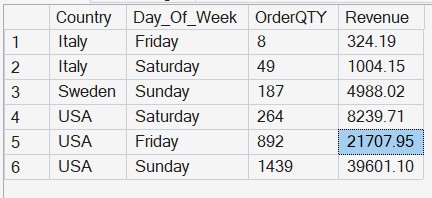

# SQL Music Analysis Project

## 📌 Objective
This project analyzes customer music purchase behavior across Europe and America using SQL.

## 🛠 Tools Used
- SQL (Microsoft sql management)

## 📊 Key Analysis
- Customer purchase patterns
- Revenue by region
- Top-selling artist and Top Customers

## 📂 Project Structure
- queries/ → Contains all SQL queries used for analysis

## 💡 Insights
- Identified top revenue-generating countries
- Discovered customer buying trends

## 📸 Artist Revenue

## 📸 Country Revenue

